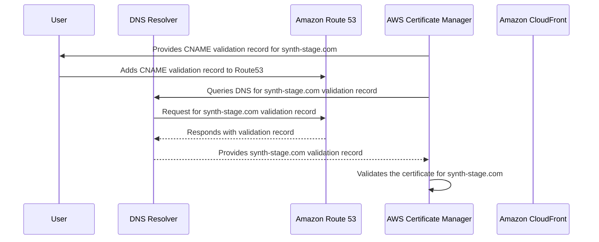

# AWS Certificate manager

## Requesting a new certificate

```mermaid
sequenceDiagram
    participant User as User
    participant DNS as DNS Resolver
    participant Route53 as Amazon Route 53
    participant ACM as AWS Certificate Manager
    participant CloudFront as Amazon CloudFront

    ACM->>User: Provides CNAME validation record for synth-stage.com
    User->>Route53: Adds CNAME validation record to Route53
    ACM->>DNS: Queries DNS for synth-stage.com validation record
    DNS->>Route53: Request for synth-stage.com validation record
    Route53-->>DNS: Responds with validation record
    DNS-->>ACM: Provides synth-stage.com validation record
    ACM->>ACM: Validates the certificate for synth-stage.com
```

