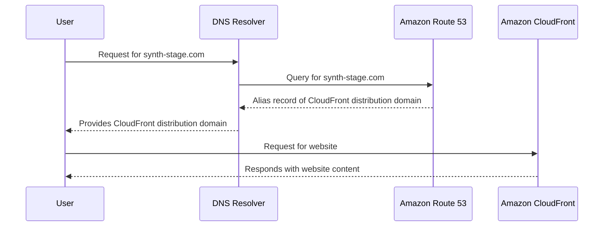
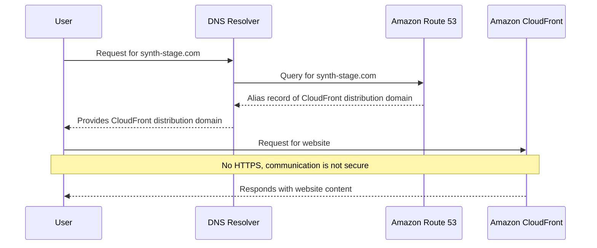

# DNS resolving details

## With Certificate

```mermaid
sequenceDiagram
    participant User as User
    participant DNS as DNS Resolver
    participant Route53 as Amazon Route 53
    participant CloudFront as Amazon CloudFront

    User->>DNS: Request for synth-stage.com
    DNS->>Route53: Query for synth-stage.com
    Route53-->>DNS: Alias record of CloudFront distribution domain
    DNS-->>User: Provides CloudFront distribution domain
    User->>CloudFront: Request for website
    CloudFront-->>User: Responds with website content
```

## No certificate

```mermaid
sequenceDiagram
    participant User as User
    participant DNS as DNS Resolver
    participant Route53 as Amazon Route 53
    participant CloudFront as Amazon CloudFront

    User->>DNS: Request for synth-stage.com
    DNS->>Route53: Query for synth-stage.com
    Route53-->>DNS: Alias record of CloudFront distribution domain
    DNS-->>User: Provides CloudFront distribution domain
    User->>CloudFront: Request for website
    Note over CloudFront,User: No HTTPS, communication is not secure
    CloudFront-->>User: Responds with website content
```
    
