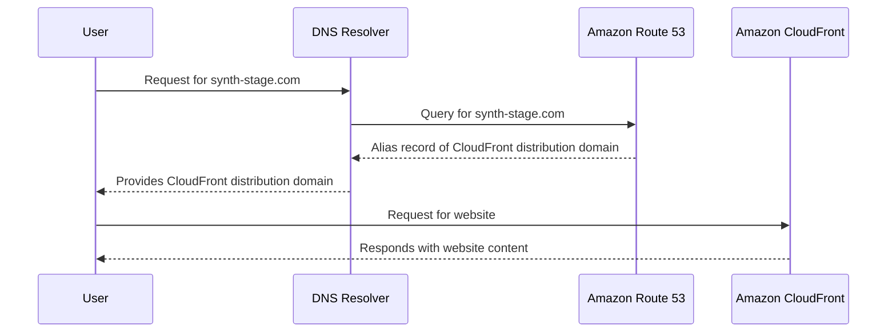
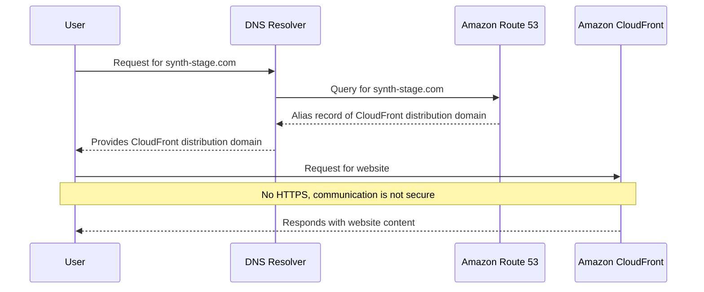
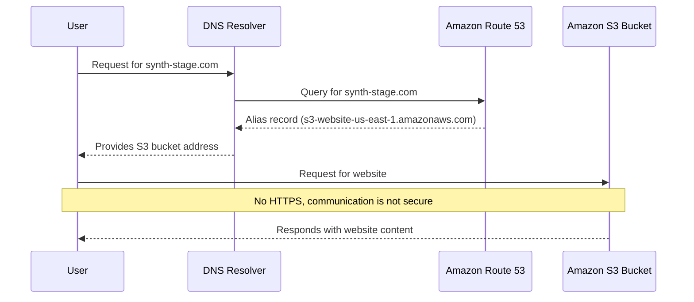

# DNS resolving details

## With Certificate

## No certificate

## Without cloudfront at all

Secure Sockets Layer/Transport Layer Security (SSL/TLS) certificates cannot be associated with a bucket url and a custom domain. You can serve directly from the bucket over https though. You just can't add a custom domain to the bucket securely, you need to add it to cloudfront and serve the bucket over cloudfront.
